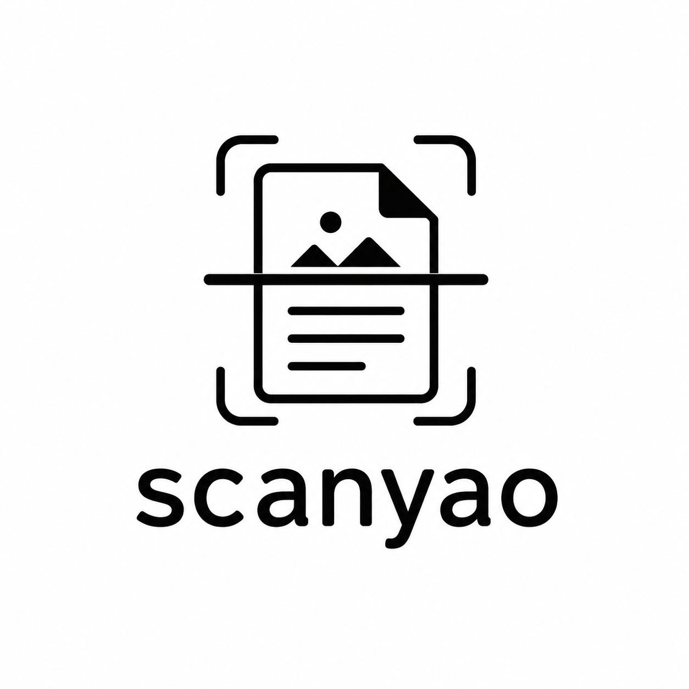

<p align="center">
  
</p>

<h1 align="center">扫耀 ScanYao</h1>

<p align="center">小而清晰的本地文档扫描器，支持 Windows、Android 与浏览器。</p>

<p align="center">
  <a href="https://github.com/Jensen-Yao/scanyao/actions/workflows/pages.yml"></a>
  
  
</p>

## 体验与下载

- 在线版 / GitHub Pages：<https://jensen-yao.github.io/scanyao/>
- Windows：从 [Releases](https://github.com/Jensen-Yao/scanyao/releases) 下载 `ScanYao-win-x64.zip`
- Android：从 [Releases](https://github.com/Jensen-Yao/scanyao/releases) 下载 `ScanYao-android-debug.apk`

Windows 默认包约 7 MB，采用 .NET 8 框架依赖发布。运行
`Start-ScanYao.ps1` 时若缺少 .NET 8 Desktop Runtime，会先询问并打开微软
官方下载页，不会静默安装。WebView2 缺失时应用也会给出提示。

## 功能

- 拍照、相册导入、桌面拖放与多页管理；导入前可选择按页扫描或先拼图
- 独立原图拼合工作台，可继续添加图片、套用长图/横排/双列/自由模板并拖动位置
- 自动建议文档边缘，四角可独立拖动微调
- 纯 TypeScript 四点透视校正与双线性采样
- 22 种场景滤镜，覆盖印刷文字、阴影、书页、报纸、手写、票据、发票、证件、证书、印章、蓝图、屏幕等扫描场景
- 滤镜按推荐/文档/票证/场景横向滑动与分类跳转，每个滤镜独立记忆强度
- 亮度、对比度、锐化、黑白阈值与滤镜强度精调
- 左右旋转、水平/垂直翻转、页面复制、排序、删除与批量套用增强
- 自动保存并恢复未完成文档；桌面右上角与手机固定工具栏提供撤销、重做、重置当前页与时间记录
- 保留处理后纵向长图、横向拼接、双列拼图、全部 JPG ZIP 与多页 PDF 导出
- 小体积、均衡、高清三档质量，PDF 支持贴合、A4、Letter 与打印边距
- 手机端上方实时预览占比可在 44%–68% 间调节并自动记忆，下方工具独立滚动并避让系统状态栏
- Apple Design 风格的浅色 / 深色响应式工作台
- 全程本地处理，无账号、广告、分析 SDK 和上传接口

## 开源参考

项目以 MIT 许可的
[OSS Document Scanner](https://github.com/ossappscollective/OSS-DocumentScanner)
作为本地扫描产品参考，固定参考提交为
`a89eb134cad2c5d96b9b6cb2746a58e893c505f4`。本仓库独立维护 TypeScript
透视变换、滤镜、PDF 写入和跨端 UI。完整说明见
[THIRD_PARTY_NOTICES.md](THIRD_PARTY_NOTICES.md)。

需要把参考项目一并拉到本机时：

```powershell
git clone https://github.com/ossappscollective/OSS-DocumentScanner.git references/OSS-DocumentScanner
git -C references/OSS-DocumentScanner checkout a89eb134cad2c5d96b9b6cb2746a58e893c505f4
```

## 本地开发

要求：Node.js 20+。Android 构建需要 JDK 17、Android SDK API 36 和 Build Tools
35；Windows 构建需要 .NET 8 SDK。

```powershell
npm ci
npm test
npm run dev
```

### Android

```powershell
npm run android:build
npm run android:install
```

`android:install` 会自动寻找 `%LOCALAPPDATA%\Android\Sdk\platform-tools\adb.exe`，
构建 APK、安装到已授权设备并启动应用。OnePlus / ColorOS 设备需要保持解锁并
允许“通过 USB 安装”。

### Windows

```powershell
npm run windows:build
```

产物位于 `artifacts/ScanYao-win-x64.zip`。如需较大的自包含包：

```powershell
powershell -ExecutionPolicy Bypass -File scripts/build-windows.ps1 -SelfContained
```

## 目录

```text
src/                  扫描内核与 Preact 编辑器
android/              Capacitor Android 工程
windows/              WPF + WebView2 Windows 壳
scripts/              双端构建、安装脚本
public/brand/          用户提供 Logo 的跨端衍生资源
docs/                  架构与隐私说明
.github/workflows/     GitHub Pages 自动部署
```

更多细节：[架构](docs/ARCHITECTURE.md) · [隐私](docs/PRIVACY.md) · [路线图](docs/ROADMAP.md)

## License

[MIT](LICENSE)
